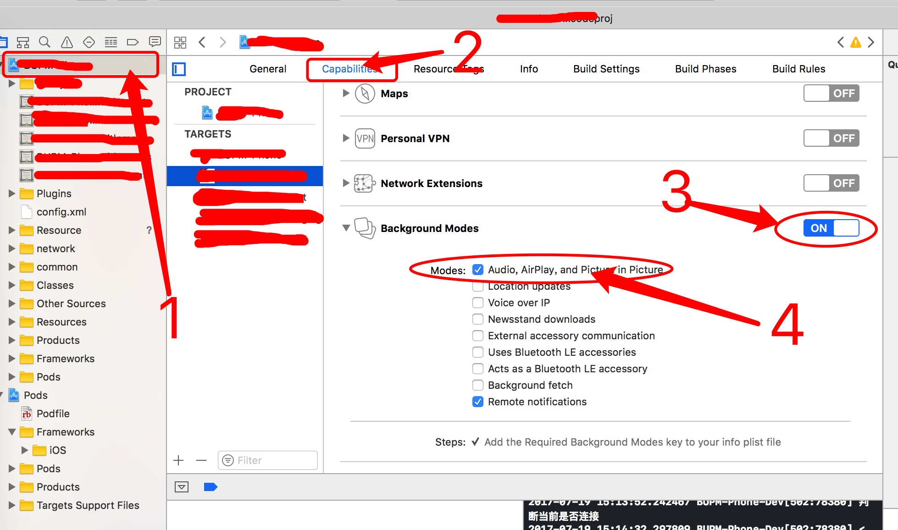

# IOS后台播放音乐
## 后台播放配置
1. Background Modes配置
    - 选中项目 -> Capabilities -> 打开 Background Modes  ->选中 Audio 如图：

2. 代码配置
    - 设置后台播放
    ```code OC
        ///设置全局播放
        [[AVAudioSession sharedInstance] setActive:YES error:nil];
        [[AVAudioSession sharedInstance] setCategory:AVAudioSessionCategoryPlayback error:nil];
        
    ```
    - 设置交互
        - 设置监听
            ```code OC
                ///设置监听锁屏的 播放，暂停，快进按钮
                [[UIApplication sharedApplication] beginReceivingRemoteControlEvents];
            ```
            ```code
                ///重新AppDelegate 的该方法捕抓用户操作
                -(void)remoteControlReceivedWithEvent:(UIEvent *)event{
                    //根据不同的操作控制 播放，暂停，等操作
                    if (event.type==UIEventSubtypeRemoteControlPlay) {
                        NSLog(@"%ld",event.subtype);
                    }
                }
            ```
        - 响应类型说明（UIEventSubtype）：
            ```code
            typedef NS_ENUM(NSInteger, UIEventSubtype) {
                // available in iPhone OS 3.0
                UIEventSubtypeNone                              = 0,
                
                // for UIEventTypeMotion, available in iPhone OS 3.0
                UIEventSubtypeMotionShake                       = 1,
                
                // for UIEventTypeRemoteControl, available in iOS 4.0
                //播放按钮
                UIEventSubtypeRemoteControlPlay                 = 100,
                //暂停
                UIEventSubtypeRemoteControlPause                = 101,
                //停止
                UIEventSubtypeRemoteControlStop                 = 102,
                //耳机点击中间按钮
                UIEventSubtypeRemoteControlTogglePlayPause      = 103,
                //屏幕的下一曲按钮或者 耳机双击中间按钮
                UIEventSubtypeRemoteControlNextTrack            = 104,
                //屏幕的上一首或者耳机三击中间按钮
                UIEventSubtypeRemoteControlPreviousTrack        = 105,
                //快退  耳机三击中间按钮且不放开
                UIEventSubtypeRemoteControlBeginSeekingBackward = 106,
                //结束快退  快退 操作松开
                UIEventSubtypeRemoteControlEndSeekingBackward   = 107,
                //快进 耳机双击中间按钮且不放开
                UIEventSubtypeRemoteControlBeginSeekingForward  = 108,
                //快进结束  快进操作松开
                UIEventSubtypeRemoteControlEndSeekingForward    = 109,
            };
            ```