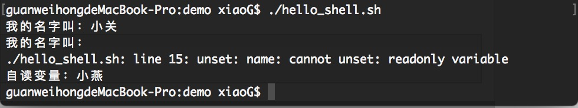

# 基本语法
## 变量
- 变量命名规则
    > - 首个字符必须为字母（a-z，A-Z）。
    > - 中间不能有空格，可以使用下划线（_）
    > - 不能使用标点符号。
    > - 不能使用bash里的关键字（可用help命令查看保留关键字）。

- 变量的使用
    ```code Shell
        # 赋值 注意格式  =号两边不能有空格
        name_str="小关"
        # 输出
        echo $name_str
        # 字符串拼接输出
        echo "我的名字叫$name_str"
        # 输出效果与 echo "我的名字叫$name_str" 相同  ${变量} 可以防止与接连的字符混淆
        echo "我的名字叫${name_str}"
        # ' ' 符号内的变量，转移符将不生效，会输出 ： 我的名字叫${name_str}
        echo '我的名字叫${name_str}'
    ```
- 只读变量 
    - 变量名前 加上 readonly
    ```code shell
        name_str="小关"
        readonly name_str
        name_str="小燕";
        echo "我的名字叫${name_str}";
    ```
    - 脚本运行结果,意思就是说，name_str 是只读变量
    ```code shell
        ./hello_shell.sh: line 2: name_str: readonly variable
    ```
    - 删除变量
        - 实例，删除变量后不可再次使用，unset不能删除readonly对象
            ```code shell
                name_str="小关";
                echo "我的名字叫：$name_str"
                ## 删除变量
                unset name_str;
                echo "我的名字叫：${name_str}"
                ##
                name="小燕";
                readonly name;
                unset name;
                echo "自读变量：${name}";

            ```
        - 运行结果
            
    - 变量类型
        - **局部变量**，在shell脚步或者命令创建的变量，仅在当前shell实例有效。
        - **环境变量**，所有shell 脚本程序都可以有效访问。
        - **shell变量**，shell内置的系统变量。
    
