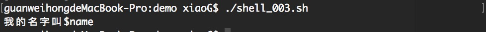
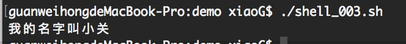
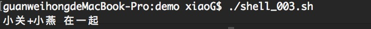

## Shell 字符串
- 序
    > shell的数据类型就只有**数字**和**字符串**
- 单引号
    - 作用
        - 单引号里的内容回被原样输出，转义符、变量的作用将会失效。
    - 例子
        - 代码
            ```code shell
                name='小关';
                echo '我的名字叫$name'
            ```
        - 运行效果如下

            
- 双引号
    - 作用
        - 双引号里的转义符，变量会生效
    - 例子
        - 代码
            ```code shell
            name='小关';
            echo "我的名字叫$name"
            ```
        - 运行结果如下

            
- 拼接
    - 例子
        ```code shell
        xiaoG="小关";
        xiaoY="小燕";
        newStr="${xiaoG}+${xiaoY}"
        echo $newStr "在一起"
        ```
    - 运行结果如下
    
        

- 长度
    - 例子
        ```code shell
        ## 获取字符串长度 ###
        str="你猜我有多长？";
        echo "你的长度是：${#str}"
        ```
    - 运行结果

        
- 截取子串
    - 例子
        - 代码，截取子串的范围 ${str:1:2} -> 截取变量 str 从第2个字符串开始截取长度未2
            ```code shell
            ## 截取子字符串 ##
            str="你截取“小关”试试看"
            echo "截取：${str:4:2}"
            ```
        - 运行结果
            

- 查找子串的位置
    - 例子
        - 代码，查找子串**“小关”**的位置
            ```code shell
                ## 查找子串位置 ##
                str="你看看“小关”在哪里？"
                subStr="小关"
                echo `expr index "$str" $subStr`
            ```
        > 因为本人使用的事macos 系统，因为 macos系统使用的是**BSD expr** 不能执行该语句，Linux 使用的是 **GNU expr** 可以执行该语句