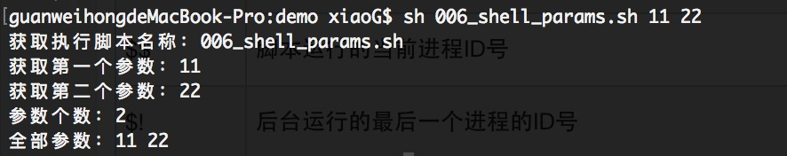

# 传参
- 序
    > 我们在开发脚本过程中，少不了会给执行的脚步传递参数 ，就好比我写一个文件复制的脚步，我需要动态传递我需要复制的文件路径和复制后存放的路径，要不然没用一次就改一次代码就太不人性化了。
- 实例
    - 比我写了个脚本名为：006_shell_params.sh  
    ```code shell
    #获取参数
    echo "获取执行脚本名称：$0"
    echo "获取第一个参数：$1"
    echo "获取第二个参数：$2"
    echo "参数个数：$#"
    echo "全部参数：$*"
    ```
    - 执行结果
        

- 参数处理表

     处理 | 说明 
     --- | --- 
     $#  | 参数个数 
     $*  | 以字符串的方式输出所有参数 , "$*" -> "param0 param1 param2"
     $@  | 与$*相同，但是用 ***"*** 号括起来，是以数组形式输出 "$@" -> "param0" "param1" "param2"
     $!  | 运行最后一个进程的ID
     $-  | 显示Shell的当前选项
     $?  | 显示最后命令的退出状态。0表示没有错误，其他任何值表明有错误。
