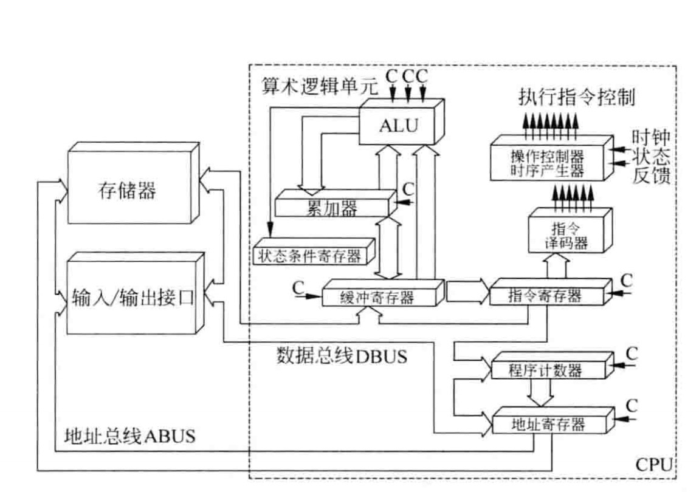

# 1 计算机系统
## 1.1 计算机系统硬件组成
- 运算器、控制器、储存器、输入设备(键盘、鼠标、摄像头等..)，输出设备(屏幕、耳机、打印机等..) 五大部件组成。运算器和控制器合成一起统称为中央处理单元简称：CPU。
### 1.2 CPU
- 功能
    - 程序控制。通过之类控制程序的执行顺序
    - 操作控制
    - 时间控制
    - 数据控制
- 组成
    > CPU的主要是由运算器、控制器、寄存器组和内部总线等部件组成，如下图1-1：
    >
    > 

    - 运算器
        - 运算器是由算数逻辑单元(ALU)、累加寄存器、数据缓冲寄存器和状态条件寄存器组成，用于完成计算机的算数和逻辑运算。运算器的所有操作都是由控制器来控制执行的。运算器的主要功能有：
            - **执行所有的算术运算。**
            - **执行逻辑运算并进行逻辑测试**
        - 各部件的功能
            - 算术逻辑单元(ALU)，负责处理数据，对数据进行算术运算和逻辑运算
            - 累加寄存器(AC)，未ALU执行运算时提供工作区，例如：**ALU**执行减法运算时前，先将**被减数**暂存到**AC**,再从**内存储存器**中取出**减数**，然后与**AC**中的**被减数**相减，将结果返回AC中存储。
            - 数据缓冲寄存器(DR)，作为CPU和内存、外部设备之间数据传送的中转站，作为CPU和内存、外部设备之间在操作速度上的缓冲，在单累加器结构的运算器中，数据缓冲寄存器还可以兼作为操作数寄存器。
            - 状态条件寄存器(PSW),保存由算术指令和逻辑指令或测试的结果建立的各种条件码内容。
    - 控制器

